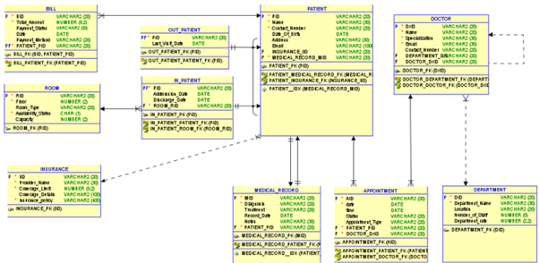

# 🏥 Hospital Management Database System

  
    

  <em>The final, normalized blueprint of our hospital database.</em>

## 🌟 Project Overview

This repository showcases a comprehensive, enterprise-grade database system designed for a large healthcare organization. It was developed as the capstone project for our Database Development course, representing a culmination of skills in database theory, design, implementation, and optimization. The system manages critical hospital operations, including patient records, doctor schedules, appointments, billing, and medical records.

The entire project was built from the ground up, starting from business requirements and ending with a fully optimized, queryable database ready for a real-world application.

---

## 🚀 The Technical Journey: From Concept to Optimization

This project was executed in four distinct, professional phases, demonstrating a full-cycle understanding of database engineering.

### 1. Logical & Physical Database Design
The foundation of any robust system is a solid design. This phase involved:
*   **Requirement Analysis:** Translating complex business rules into a logical data model.
*   **ERD Modeling:** Creating detailed Entity-Relationship Diagrams to visualize the database structure.
*   **Normalization:** Applying normalization principles (up to **3NF**) to eliminate data redundancy and prevent anomalies, ensuring rock-solid data integrity.

> **[📂 View the full design artifacts in the `1_Database_Design` folder.](./1_Database_Design)**

### 2. Database Implementation (DDL & DML)
The design was brought to life using SQL. This phase included:
*   **Schema Creation (DDL):** Writing `CREATE TABLE` scripts with precise data types, primary keys, foreign keys, and constraints.
*   **Data Population (DML):** Authoring `INSERT INTO` scripts to populate the database with over 600 records of realistic, sample data across 10+ tables.
*   **Sequence Implementation:** Using `CREATE SEQUENCE` for automated primary key generation.

> **[💻 Explore the SQL scripts in the `2_SQL_Scripts` folder.](./2_SQL_Scripts)**

### 3. Advanced Data Retrieval (SQL Queries & Views)
A database is only as good as the insights it can provide. This phase focused on extracting meaningful information:
*   **Complex Queries:** Developing 8 advanced SQL queries to answer critical business questions, utilizing `JOINs`, aggregate functions, `GROUP BY`, and subqueries.
*   **Creating Views:** Implementing `CREATE VIEW` to simplify complex queries and provide a secure, abstract layer for end-users.

> **[🔍 See all queries and views in `Queries_and_Views.sql`.](./2_SQL_Scripts/Queries_and_Views.sql)**

### 4. Performance Tuning & Optimization
To ensure the system scales efficiently, we focused on performance:
*   **Bottleneck Analysis:** Identifying slow-running queries by analyzing their execution plans.
*   **Indexing Strategy:** Implementing a strategic `CREATE INDEX` on key columns used in `WHERE` clauses and `JOIN` conditions.
*   **Performance Measurement:** Demonstrating a tangible improvement in query execution time and a reduction in cost, proving the effectiveness of the optimization.

> **[⚡️ Discover the optimization results in the `3_Performance_Tuning` folder.](./3_Performance_Tuning)**

---

## 🛠️ Technologies & Skills Demonstrated

*   **Languages:** `SQL`, `PL/SQL (Oracle)`
*   **Database Concepts:**
    *   Relational Database Design & Normalization (1NF, 2NF, 3NF)
    *   Data Definition Language (DDL) & Data Manipulation Language (DML)
    *   Advanced SQL Querying (Joins, Subqueries, Aggregation)
    *   Database Objects (Tables, Views, Indexes, Sequences, Constraints)
*   **Performance:**
    *   Query Optimization & Performance Tuning
    *   Execution Plan Analysis
    *   Index Selectivity

---

## 💬 Personal Reflection

This was one of the most challenging and rewarding projects we have undertaken. It taught us the critical importance of meticulous design and the profound impact of optimization on system performance. Moving from a theoretical ERD to a fully functional, high-performance database solidified my understanding of the entire data lifecycle. The pride I feel in this project comes from the depth of its complexity and the elegance of the final, structured solution.

---

## 👥 The Team

This project was a successful collaboration between a dedicated team of three:

*   **Hessa Khalfan** ([@Heskal](https://github.com/Heskal ))
*   **Nourah Alghfeli**
*   **Maryam Al Ali**

Our collective effort and effective communication were key to overcoming the complexities of this project and delivering a high-quality, enterprise-ready database system.
